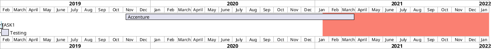

---
{"dg-publish":true,"permalink":"/00-inbox/portfolio/","dgShowLocalGraph":true}
---

> [!quote] Thoughts
> Github can show that:
> - I'm really into my area
> - I like to learn
> - The tools I use
>Portfolio (alongside my personal blog/site):
> - Can show that I'm confident enough to stand myself as someone who teaches
> - Create empathy with leaders who do the same (has a blog, etc.)

- maybe it is a good option to add a linkedIn badge to my portfolio page